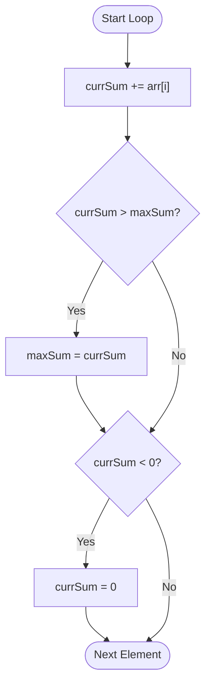

# Kadane's Algorithm

Kadane's Algorithm is an efficient iterative dynamic programming algorithm used to find the **maximum sum of a contiguous subarray** within a one-dimensional array of numbers.

---

## 🚀 The Core Idea

The fundamental intuition is: **"If a prefix sum becomes negative, it will only decrease the sum of any future subarray. So, we should discard it and start fresh from the current element."**

### **Logic Steps**
1.  **Maintain two variables**:
    *   `currSum`: The sum of the current subarray we are looking at.
    *   `maxSum`: The maximum sum seen so far across all subarrays.
2.  **Iterate through the array**:
    *   Add the current element to `currSum`.
    *   Update `maxSum` if `currSum` is greater than `maxSum`.
    *   **If `currSum` becomes less than 0**, reset `currSum` to 0 (discard the negative prefix).

---

## 📊 Visualizing the Logic

---

## ⏱️ Complexity Analysis

| Metric | Complexity | Why? |
| :--- | :--- | :--- |
| **Time Complexity** | **$O(n)$** | We traverse the array exactly once. |
| **Space Complexity** | **$O(1)$** | We only use two variables (`currSum`, `maxSum`). |

---

## 💡 Dry Run Example
**Input**: `[-2, 1, -3, 4, -1, 2, 1, -5, 4]`

| Item | Logic | `currSum` | `maxSum` | Action |
| :--- | :--- | :--- | :--- | :--- |
| -2 | Start | -2 | -2 | `currSum < 0` $\rightarrow$ Reset `currSum = 0` |
| 1 | `0 + 1` | 1 | 1 | Update `maxSum` |
| -3 | `1 - 3` | -2 | 1 | `currSum < 0` $\rightarrow$ Reset `currSum = 0` |
| 4 | `0 + 4` | 4 | 4 | Update `maxSum` |
| -1 | `4 - 1` | 3 | 4 | No change to `maxSum` |
| 2 | `3 + 2` | 5 | 5 | Update `maxSum` |
| 1 | `5 + 1` | 6 | 6 | Update `maxSum` |

**Final Result**: `maxSum = 6` (Subarray: `[4, -1, 2, 1]`)
