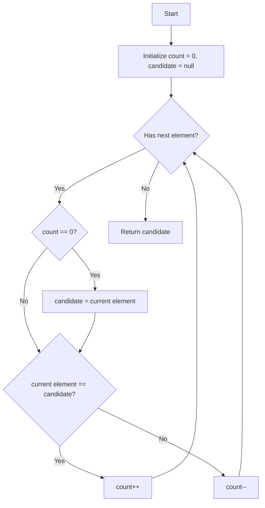

# Moore's Voting Algorithm

## Overview
The Boyer-Moore Majority Vote Algorithm is an efficient algorithm to find the majority element in an array. A majority element is an element that appears more than `n/2` times in an array of size `n`.

## Algorithm Explanation
The algorithm works in two phases:
1. **Candidate Selection**: Find a candidate for the majority element.
2. **Candidate Verification**: Verify if the candidate is indeed the majority element (only required if it's not guaranteed that a majority element exists).

### 1. Candidate Selection
1. Initialize two variables: `candidate = -1` (or any value) and `count = 0`.
2. Iterate through each element in the array:
   - If `count == 0`, assign `candidate = current_element` and `count = 1`.
   - Else if `current_element == candidate`, increment `count`.
   - Else decrement `count`.

**Intuition:** 
Since the majority element appears more than `n/2` times, its count will outlast all other elements combined. Every time we encounter a different element, we pair it with the current candidate and "cancel" them out by decrementing the count. The majority element will be the one remaining at the end.

### 2. Candidate Verification
If the problem does not guarantee that a majority element exists, we need a second pass over the array to count the actual occurrences of the `candidate` and check if it's greater than `n/2`.

## Mermaid Visualization

Here is a flowchart representing the Candidate Selection phase:

## Complexity
- **Time Complexity:** O(N) where N is the number of elements in the array. We traverse the array at most twice.
- **Space Complexity:** O(1) as we only use two variables (`candidate` and `count`), regardless of the input size.
