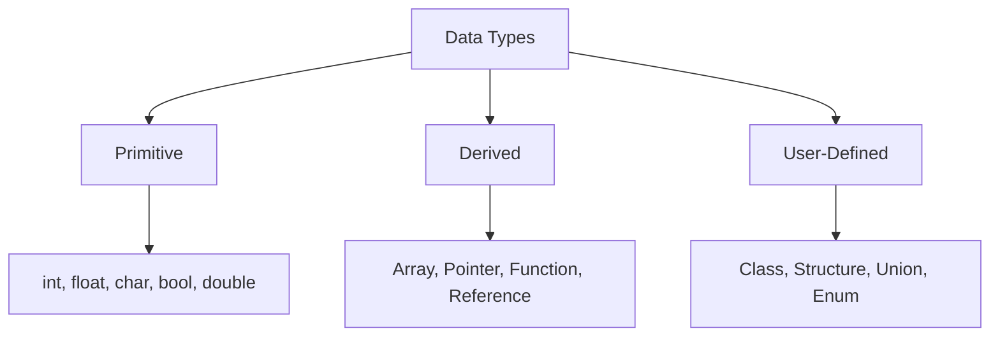

# C++ Basics: Variables, Data Types, and Operators

The fundamental building blocks of C++ programming: how to store data (variables and types) and how to manipulate it (operators).

---

## 1. Variables

A variable is a container (memory location) used to store data. In C++, you must declare a variable with a specific data type before using it.

### **Syntax**
`type variableName = value;`

### **Declaration vs. Initialization**
* **Declaration:** Telling the compiler the variable's name and type. (e.g., `int age;`)
* **Initialization:** Assigning a value to the variable at the time of declaration. (e.g., `int age = 25;`)

### **Rules for Naming Variables**
* Must begin with a letter or an underscore (`_`).
* Can contain letters, numbers, and underscores.
* Cannot contain spaces or special characters (like `!`, `@`, `#`).
* Cannot be a C++ keyword (like `int`, `return`, `class`).
* Case-sensitive (`myVar` and `myvar` are different).

---

## 2. Data Types

Data types specify the size and type of information a variable will store. 

### **Data Type Classification**



### **Primary (Built-in) Data Types**

| Data Type | Description | Size (typical) | Example |
| :--- | :--- | :--- | :--- |
| `int` | Integers (whole numbers) | 4 bytes | `int age = 30;` |
| `float` | Single-precision floating point (decimals) | 4 bytes | `float pi = 3.14f;` |
| `double` | Double-precision floating point (more precise) | 8 bytes | `double price = 19.99;` |
| `char` | Single character (enclosed in single quotes) | 1 byte | `char grade = 'A';` |
| `bool` | Boolean (true or false) | 1 byte | `bool isCoding = true;` |

### **Type Modifiers**
You can modify the primary data types to change their size or range:
* `signed`: Can hold positive and negative numbers (default for `int`).
* `unsigned`: Can hold only positive numbers (doubles the positive range).
* `short`: Optimizes space if you know the number will be small (usually 2 bytes).
* `long`: Increases the capacity of the data type (e.g., `long long int`).

### **Strings**
To store text, C++ uses the `string` type. Note: You must include the `<string>` library to use it.

```cpp
#include <iostream>
#include <string>
using namespace std;

string greeting = "Hello, World!";
```

---

## 3. Type Casting

Type casting is the process of converting one data type into another.

### **Types of Casting**
1.  **Implicit Conversion (Automatic)**: Done automatically by the compiler.
    *   Example: `double d = 10;` (int 10 is converted to double 10.0)
2.  **Explicit Conversion (Manual)**: Done manually by the programmer.
    *   Example: `double pi = 3.14; int intPi = (int)pi;` (Result is 3)

---

## 4. Operators

Operators are special symbols used to perform operations on variables and values.

### **A. Arithmetic Operators**
Used to perform common mathematical operations.

* `+` : Addition (`x + y`)
* `-` : Subtraction (`x - y`)
* `*` : Multiplication (`x * y`)
* `/` : Division (`x / y`) - *Note: Integer division truncates the decimal (e.g., 5/2 = 2).*
* `%` : Modulo (returns the remainder of division) (`x % y`)

### **B. Increment and Decrement Operators**
* `++` : Increment (increases the value by 1). 
  * `x++` (Post-increment)
  * `++x` (Pre-increment)
* `--` : Decrement (decreases the value by 1).
  * `x--` (Post-decrement)
  * `--x` (Pre-decrement)

### **C. Assignment Operators**
Used to assign values to variables.

* `=` : Assign (`x = 5`)
* `+=` : Add and assign (`x += 3` is the same as `x = x + 3`)
* `-=` : Subtract and assign (`x -= 3` is the same as `x = x - 3`)
* `*=` : Multiply and assign (`x *= 3` is the same as `x = x * 3`)
* `/=` : Divide and assign (`x /= 3` is the same as `x = x / 3`)
* `%=` : Modulo and assign (`x %= 3` is the same as `x = x % 3`)

### **D. Relational (Comparison) Operators**
Used to compare two values. They return a boolean value (`true` or `false` / `1` or `0`).

* `==` : Equal to (`x == y`)
* `!=` : Not equal to (`x != y`)
* `>` : Greater than (`x > y`)
* `<` : Less than (`x < y`)
* `>=` : Greater than or equal to (`x >= y`)
* `<=` : Less than or equal to (`x <= y`)

### **E. Logical Operators**
Used to determine the logic between variables or values.

* `&&` : Logical AND. Returns `true` if both statements are true. (`x < 5 && x < 10`)
* `||` : Logical OR. Returns `true` if one of the statements is true. (`x < 5 || x < 4`)
* `!` : Logical NOT. Reverses the result; returns `false` if the result is true. (`!(x < 5 && x < 10)`)

---

## Example Program: Putting It All Together

```cpp
#include <iostream>
#include <string>
using namespace std;

int main() {
    // 1. Variables and Data Types
    int age = 22;
    double balance = 1250.75;
    char grade = 'A';
    bool isStudent = true;
    string name = "John Doe";

    // 2. Type Casting
    int roundedBalance = (int)balance; // Explicit casting

    // 3. Operators
    int a = 10, b = 3;
    int sum = a + b;
    int mod = a % b;

    // 4. Output
    cout << "Name: " << name << endl;
    cout << "Age next year: " << ++age << endl;
    cout << "Student Status: " << isStudent << endl;
    cout << "Rounded Balance: " << roundedBalance << endl;

    if (age > 18 && isStudent) {
        cout << "Access Granted to University Portal." << endl;
    }

    return 0;
}
```