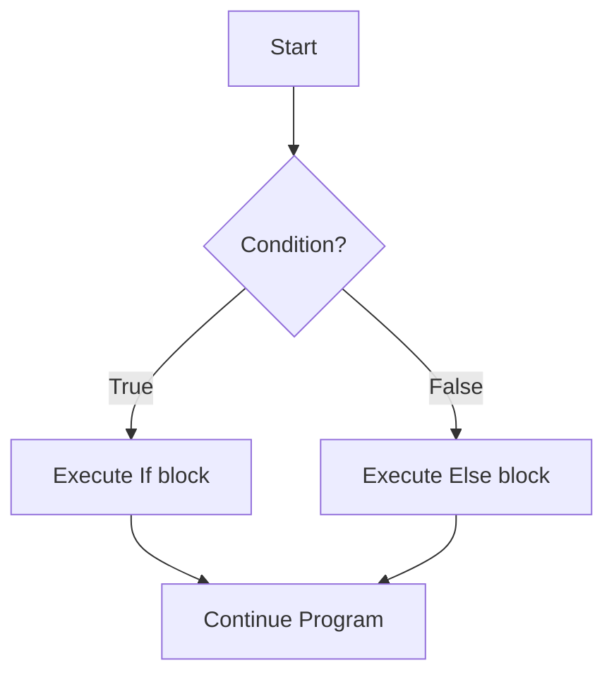
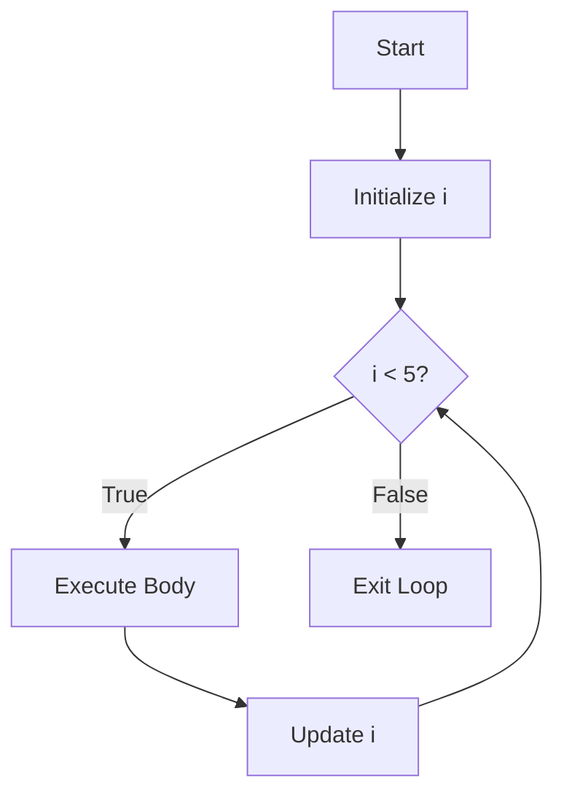

# C++ Basics: Conditionals and Loops

Control flow statements allow you to control the execution of your code based on conditions and repeat blocks of code multiple times.

---

## 1. Conditional Statements

Conditional statements are used to perform different actions based on different conditions.

### **A. If-Else Statements**

The most common way to branch logic in C++.

*   **`if`**: Executes a block of code if the condition is true.
*   **`else if`**: Provides a new condition to test if the previous `if` was false.
*   **`else`**: Executes a block of code if all previous conditions were false.

```cpp
int age = 18;

if (age >= 18) {
    cout << "You are an adult." << endl;
} else if (age > 12) {
    cout << "You are a teenager." << endl;
} else {
    cout << "You are a child." << endl;
}
```

#### **Visualizing If-Else Flow**



### **B. Ternary Operator (Shorthand If-Else)**

A concise way to write simple if-else statements.
`variable = (condition) ? expressionTrue : expressionFalse;`

```cpp
int number = 10;
string result = (number % 2 == 0) ? "Even" : "Odd";
```

### **C. Switch Statement**

Used to select one of many code blocks to be executed. It is often more readable than long if-else-if chains when checking a single variable against multiple values.

```cpp
int day = 4;
switch (day) {
    case 1: cout << "Monday"; break;
    case 2: cout << "Tuesday"; break;
    case 3: cout << "Wednesday"; break;
    case 4: cout << "Thursday"; break;
    case 5: cout << "Friday"; break;
    default: cout << "Weekend!";
}
```

---

## 2. Loops

Loops are used to execute a block of code repeatedly as long as a specific condition is met.

### **A. While Loop**

Checks the condition **before** executing the loop body.

```cpp
int i = 0;
while (i < 5) {
    cout << i << " ";
    i++;
}
// Output: 0 1 2 3 4
```

### **B. Do-While Loop**

Executes the loop body **once** before checking the condition. Use this when the code must run at least once.

```cpp
int i = 0;
do {
    cout << i << " ";
    i++;
} while (i < 5);
```

### **C. For Loop**

Best used when you know exactly how many times you want to loop.

**Syntax:**
`for (initialization; condition; update) { ... }`

```cpp
for (int i = 0; i < 5; i++) {
    cout << "Iteration: " << i << endl;
}
```

#### **Visualizing Loop Flow (For Loop)**



---

## 3. Jump Statements

Used to alter the flow of loops.

*   **`break`**: Immediately exits the loop or switch statement.
*   **`continue`**: Skips the current iteration of the loop and moves to the next one.

```cpp
for (int i = 0; i < 10; i++) {
    if (i == 5) continue; // Skip 5
    if (i == 8) break;    // Stop at 8
    cout << i << " ";
}
// Output: 0 1 2 3 4 6 7
```

---

## Example Program: Putting it all Together

```cpp
#include <iostream>
using namespace std;

int main() {
    int limit;
    cout << "Enter a limit for even numbers: ";
    cin >> limit;

    cout << "Even numbers up to " << limit << ":" << endl;
    for (int i = 1; i <= limit; i++) {
        // Condition to check even numbers
        if (i % 2 == 0) {
            cout << i << " ";
        } else {
            continue; // Skip odd numbers
        }
    }
    
    return 0;
}
```
