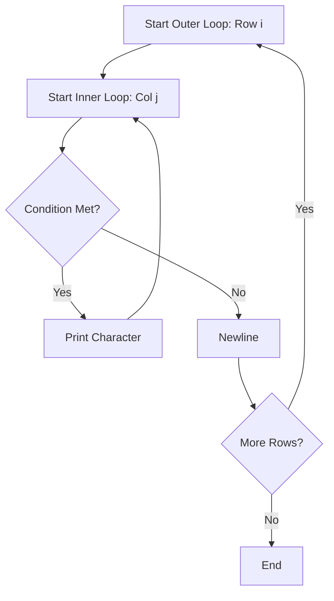

# Logic Building: Pattern Problems in C++

Pattern problems are excellent for strengthening your logic with **nested loops**. They help you understand how rows and columns interact within a coordinate system.

---

## 1. The Core Strategy

Most pattern problems can be solved by following these 4 rules:

1.  **Outer Loop**: Responsible for the **Rows** (Horizontal lines).
2.  **Inner Loop**: Responsible for the **Columns** (Vertical lines).
3.  **Observation**: Find a mathematical relationship between the current Row number ($i$) and the Column number ($j$).
4.  **Print**: Decide what to print (star, number, space) and when to move to a new line (`endl`).

### **Nested Loop Visualization**



---

## 2. Basic Patterns

### **A. Solid Rectangle (n x m)**
The simplest pattern where every cell contains a star.

```cpp
for (int i = 0; i < rows; i++) {
    for (int j = 0; j < cols; j++) {
        cout << "* ";
    }
    cout << endl;
}
```

### **B. Hollow Rectangle**
Prints stars only on the boundaries (i=0, i=n-1, j=0, j=m-1).

```cpp
for (int i = 0; i < rows; i++) {
    for (int j = 0; j < cols; j++) {
        if (i == 0 || i == rows-1 || j == 0 || j == cols-1) {
            cout << "*";
        } else {
            cout << " ";
        }
    }
    cout << endl;
}
```

---

## 3. Triangle Patterns

### **A. Left Half-Pyramid**
The number of stars in each row is equal to the row number ($j \le i$).

```cpp
for (int i = 1; i <= n; i++) {
    for (int j = 1; j <= i; j++) {
        cout << "* ";
    }
    cout << endl;
}
```

### **B. Inverted Left Half-Pyramid**
Stars decrease as row number increases ($j \le n-i+1$).

```cpp
for (int i = n; i >= 1; i--) {
    for (int j = 1; j <= i; j++) {
        cout << "* ";
    }
    cout << endl;
}
```

---

## 4. Advanced Patterns

### **A. Full Pyramid**
Requires printing spaces before stars to center them.

```cpp
for (int i = 1; i <= n; i++) {
    // 1. Print Spaces
    for (int j = 1; j <= n - i; j++) {
        cout << " ";
    }
    // 2. Print Stars
    for (int k = 1; k <= 2 * i - 1; k++) {
        cout << "*";
    }
    cout << endl;
}
```

### **B. Number Triangle (Floyd's Triangle)**
Consecutive numbers in a triangle shape.

```cpp
int count = 1;
for (int i = 1; i <= n; i++) {
    for (int j = 1; j <= i; j++) {
        cout << count++ << " ";
    }
    cout << endl;
}
```

---

## 5. Best Practices & Tips

1.  **Dry Run**: Before coding, draw the pattern on paper and index the rows/columns starting from 0 or 1.
2.  **Variable Naming**: Use `i` for rows and `j` for columns consistently.
3.  **Space Handling**: Pay attention to trailing spaces or if a space is needed after every character (e.g., `cout << "* ";` vs `cout << "*";`).
4.  **Square Check**: If `rows == cols`, it's a square pattern; otherwise, it's rectangular.
5.  **Small Cases**: Always test your logic with `n=1` and `n=3` to ensure the formulas work.

---

## Comprehensive Example: The Diamond Pattern

```cpp
#include <iostream>
using namespace std;

int main() {
    int n = 5;

    // Upper Half
    for (int i = 1; i <= n; i++) {
        for (int j = 1; j <= n - i; j++) cout << " ";
        for (int j = 1; j <= 2 * i - 1; j++) cout << "*";
        cout << endl;
    }

    // Lower Half
    for (int i = n - 1; i >= 1; i--) {
        for (int j = 1; j <= n - i; j++) cout << " ";
        for (int j = 1; j <= 2 * i - 1; j++) cout << "*";
        cout << endl;
    }

    return 0;
}
```
