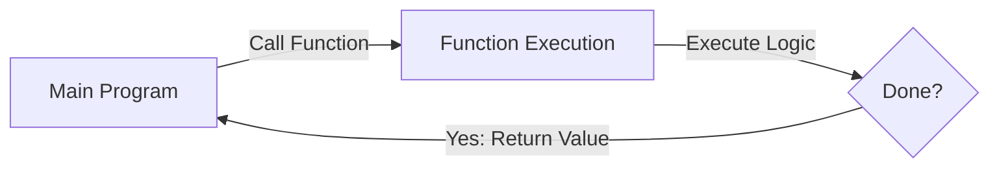

# C++ Basics: Functions

Functions are independent blocks of code designed to perform a specific task. They make code **modular**, **reusable**, and **cleaner**.

---

## 1. Anatomy of a Function

A function consists of several key components:

```cpp
returnType functionName(parameterList) {
    // Body: The code to be executed
    return value; // (If returnType is not void)
}
```

### **Parts Explained**
*   **Return Type**: The type of value the function returns (e.g., `int`, `double`, `void` if there is no return).
*   **Function Name**: A descriptive name (using camelCase or snake_case).
*   **Parameters**: Inputs supplied to the function (optional).
*   **Body**: The logic enclosed in `{}`.

### **Function Flow Visualization**



---

## 2. Declaration vs. Definition

In C++, you must tell the compiler about a function before you use it.

1.  **Declaration (Prototype)**: Usually goes before `main()`. It tells the compiler the function exists.
    *   `int add(int, int);`
2.  **Definition**: The actual logic of the function.
    *   `int add(int a, int b) { return a + b; }`

---

## 3. Pass by Value vs. Pass by Reference

This is one of the most important concepts in C++.

### **A. Pass by Value**
A **copy** of the variable is passed. Changes made inside the function **do not** affect the original variable.

```cpp
void increment(int x) {
    x++;
}
// Original variable stays the same.
```

### **B. Pass by Reference**
The **memory address** (using `&`) of the original variable is passed. Changes made inside the function **do** affect the original variable.

```cpp
void increment(int &x) {
    x++;
}
// Original variable is updated!
```

---

## 4. Function Overloading

C++ allows multiple functions to have the **same name**, provided they have **different parameter lists** (either different types or a different number of parameters).

```cpp
int sum(int a, int b) { return a + b; }
double sum(double a, double b) { return a + b; }
```
*The compiler decides which function to use based on the arguments you pass.*

---

## 5. Best Practices

1.  **Do One Thing**: Each function should perform exactly one task.
2.  **Meaningful Names**: Use verbs for names (e.g., `calculateResult` instead of just `result`).
3.  **Default Arguments**: Use them sparingly for optional inputs.
    *   `void greet(string name = "User");`
4.  **Avoid Global Variables**: Pass data into functions via parameters whenever possible.
5.  **Return Early**: If a condition makes the rest of the function unnecessary, use `return` early.

---

## Example Program: Putting it all Together

```cpp
#include <iostream>
using namespace std;

// Function Declaration
bool isEven(int n);
void swapFiles(int &a, int &b);

int main() {
    int x = 10, y = 20;

    cout << "Is 10 even? " << (isEven(x) ? "Yes" : "No") << endl;

    cout << "Before swap: x=" << x << ", y=" << y << endl;
    swapFiles(x, y); // Pass by Reference
    cout << "After swap: x=" << x << ", y=" << y << endl;

    return 0;
}

// Function Definitions
bool isEven(int n) {
    return n % 2 == 0;
}

void swapFiles(int &a, int &b) {
    int temp = a;
    a = b;
    b = temp;
}
```
