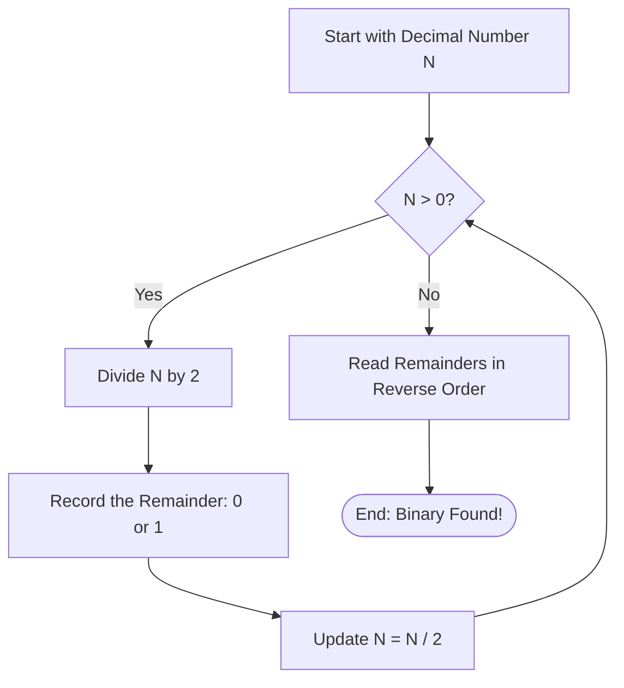

# Logic Building: Binary Number System

Before diving deeper into data structures, it's crucial to understand how computers store and manipulate data at the lowest level: using the **Binary Number System**.

---

## 1. What is Binary?

Humans use the **Decimal System** (Base-10), which consists of 10 digits: `0, 1, 2, 3, 4, 5, 6, 7, 8, 9`.
Computers use the **Binary System** (Base-2), which consists of only 2 digits: `0` and `1`. These correspond to the "Off" and "On" states of transistors in a computer's CPU.

*   **Bit**: A single binary digit (`0` or `1`).
*   **Byte**: A group of 8 bits.

---

## 2. Converting Decimal to Binary

To convert a decimal number to binary, you repeatedly divide the number by 2 and record the remainders. The binary representation is formed by reading the remainders from bottom to top (last to first).

### **Algorithm Visualization**



### **Example: Convert 13 to Binary**
1. `13 / 2` = 6, Remainder = **1**
2. `6 / 2` = 3, Remainder = **0**
3. `3 / 2` = 1, Remainder = **1**
4. `1 / 2` = 0, Remainder = **1**

Reading from bottom to top: **1101**

---

## 3. Converting Binary to Decimal

To convert binary to decimal, multiply each bit by $2^n$, where $n$ is the position of the bit starting from 0 on the far right, and sum the results.

### **Example: Convert 1101 to Decimal**

| Binary | 1 | 1 | 0 | 1 |
| :--- | :---: | :---: | :---: | :---: |
| **Position (n)** | 3 | 2 | 1 | 0 |
| **Calculation** | 1 × 2³ | 1 × 2² | 0 × 2¹ | 1 × 2⁰ |
| **Value** | 8 | 4 | 0 | 1 |

Sum: `8 + 4 + 0 + 1` = **13**

---

## 4. Bitwise Operators in C++

Bitwise operators allow you to manipulate individual bits of integer data types directly. This is extremely fast and heavily used in competitive programming and advanced DSA logic.

| Operator | Symbol | Description | Example (A = 5 (`0101`), B = 3 (`0011`)) |
| :--- | :---: | :--- | :--- |
| **AND** | `&` | Sets bit to 1 if BOTH bits are 1. | `A & B` = 0001 (1) |
| **OR** | `\|` | Sets bit to 1 if ONE of the bits is 1. | `A \| B` = 0111 (7) |
| **XOR** | `^` | Sets bit to 1 if bits are DIFFERENT. | `A ^ B` = 0110 (6) |
| **NOT** | `~` | Inverts all bits (0 to 1, 1 to 0). | `~A` = 1010 (Depends on int size) |
| **Left Shift** | `<<` | Shifts bits left (multiplies by 2). | `A << 1` = 1010 (10) |
| **Right Shift**| `>>` | Shifts bits right (divides by 2). | `A >> 1` = 0010 (2) |

---

## 5. Example Program: Bitwise Operations in Action

```cpp
#include <iostream>
using namespace std;

int main() {
    int a = 5; // Binary: 0000 0101
    int b = 3; // Binary: 0000 0011

    cout << "Bitwise Operations on a=5 and b=3:" << endl;
    cout << "a & b (AND) = " << (a & b) << endl;       // 0101 & 0011 = 0001 (1)
    cout << "a | b (OR)  = " << (a | b) << endl;       // 0101 | 0011 = 0111 (7)
    cout << "a ^ b (XOR) = " << (a ^ b) << endl;       // 0101 ^ 0011 = 0110 (6)
    cout << "a << 1 (Left Shift) = " << (a << 1) << endl; // 5 * 2 = 10
    cout << "a >> 1 (Right Shift) = " << (a >> 1) << endl; // 5 / 2 = 2

    // Pro-Tip: Checking if a number is even or odd using Bitwise AND
    // It is much faster than using modulo (num % 2 == 0)
    int num = 13;
    if ((num & 1) == 0) {
        cout << num << " is Even." << endl;
    } else {
        cout << num << " is Odd." << endl;
    }

    return 0;
}
```