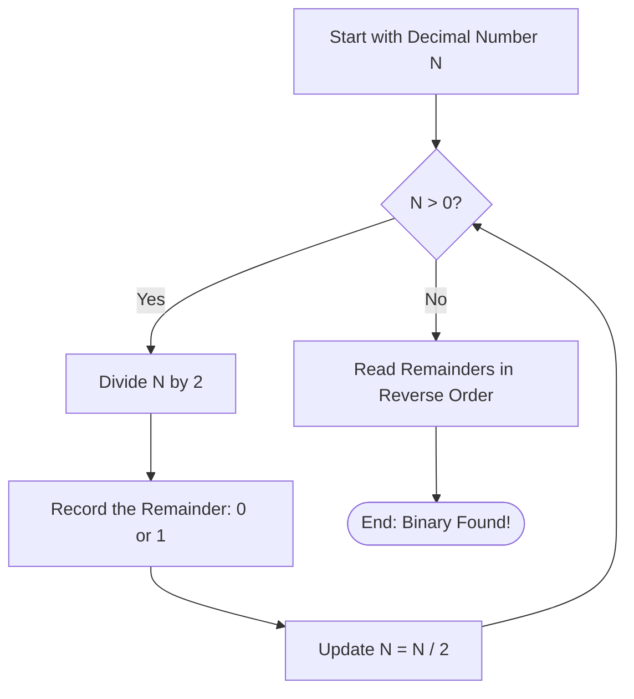

# Logic Building: Binary and Bitwise Operators

Before diving deeper into data structures, it's crucial to understand how computers store and manipulate data at the lowest level: using the **Binary Number System**.

---

## 1. What is Binary?

Humans use the **Decimal System** (Base-10), which consists of 10 digits: `0, 1, 2, 3, 4, 5, 6, 7, 8, 9`.
Computers use the **Binary System** (Base-2), which consists of only 2 digits: `0` and `1`. These correspond to the "Off" and "On" states of transistors in a computer's CPU.

*   **Bit**: A single binary digit (`0` or `1`).
*   **Byte**: A group of 8 bits.

---

## 2. Converting Decimal to Binary

To convert a decimal number to binary, you repeatedly divide the number by 2 and record the remainders. The binary representation is formed by reading the remainders from bottom to top (last to first).

### **Algorithm Visualization**



### **Example: Convert 13 to Binary**
1. `13 / 2` = 6, Remainder = **1**
2. `6 / 2` = 3, Remainder = **0**
3. `3 / 2` = 1, Remainder = **1**
4. `1 / 2` = 0, Remainder = **1**

Reading from bottom to top: **1101**

---

## 3. Converting Binary to Decimal

To convert binary to decimal, multiply each bit by $2^n$, where $n$ is the position of the bit starting from 0 on the far right, and sum the results.

### **Example: Convert 1101 to Decimal**

| Binary | 1 | 1 | 0 | 1 |
| :--- | :---: | :---: | :---: | :---: |
| **Position (n)** | 3 | 2 | 1 | 0 |
| **Calculation** | 1 × 2³ | 1 × 2² | 0 × 2¹ | 1 × 2⁰ |
| **Value** | 8 | 4 | 0 | 1 |

Sum: `8 + 4 + 0 + 1` = **13**

---

## 4. Bitwise Operators (Detailed Description)

Bitwise operators manipulate data at the bit level. They are extremely efficient because they directly interact with the CPU's binary logic.

### **A. Core Logic Operators**

| Operator | Symbol | Rule | Truth Table (A, B) |
| :--- | :---: | :--- | :--- |
| **AND** | `&` | Result is `1` only if **both** bits are `1`. | `0&0=0, 0&1=0, 1&1=1` |
| **OR** | `\|` | Result is `1` if **at least one** bit is `1`. | `0\|0=0, 0\|1=1, 1\|1=1` |
| **XOR** | `^` | Result is `1` if bits are **different**. | `0^0=0, 1^1=0, 0^1=1` |
| **NOT** | `~` | **Inverts** the bits (0 → 1, 1 → 0). | `~0=1, ~1=0` |

> [!IMPORTANT]
> **Understanding NOT (`~`):** In C++, `~a` doesn't just flip bits; it calculates the **2's complement**. For an integer `a`, `~a` is equal to `-(a + 1)`.

### **B. Shift Operators**

*   **Left Shift (`<<`)**: Shifts bits to the left, filling empty spots with `0`. Equivalent to multiplying by $2^n$.
    *   *Example*: `5 << 1` → `0101` becomes `1010` (10).
*   **Right Shift (`>>`)**: Shifts bits to the right. Equivalent to dividing by $2^n$ (discarding remainder).
    *   *Example*: `5 >> 1` → `0101` becomes `0010` (2).

---

## 5. Data Type Modifiers

C++ provides modifiers to alter the memory size or interpretation of standard data types (like `int`, `char`, `double`).

| Modifier | Size (typical) | Description | Range (for 4-byte int) |
| :--- | :---: | :--- | :--- |
| **`signed`** | 4 Bytes | Can store both +ve and -ve numbers. (Default) | $-2^{31}$ to $2^{31}-1$ |
| **`unsigned`** | 4 Bytes | Stores only +ve numbers. Uses sign bit for magnitude. | $0$ to $2^{32}-1$ |
| **`short`** | 2 Bytes | Reduces memory usage for small numbers. | $-32,768$ to $32,767$ |
| **`long`** | 4 or 8 Bytes | Ensures at least 4 bytes of storage. | Varies by system |
| **`long long`**| 8 Bytes | Used for very large numbers. | $\approx \pm 9 \times 10^{18}$ |

---

## 6. Real-World & DSA Use Cases

### **A. DSA Problem Solving**
1.  **Even or Odd**: `(n & 1)` is faster than `(n % 2)`. If `1`, it's odd.
2.  **Unique Element**: In an array where every element appears twice except one, **XOR** all elements. The duplicates cancel out (`a ^ a = 0`), leaving the unique one.
3.  **Power of 2**: A number is a power of 2 if `(n & (n - 1)) == 0`.
4.  **Swapping**: `a = a ^ b; b = a ^ b; a = a ^ b;` (Swaps without a temporary variable).

### **B. Real-World Applications**
1.  **File Permissions (Unix)**: Permissions like `rwx` (read, write, execute) are stored as 3 bits. `7` (111) means all permissions, `4` (100) means read-only.
2.  **Graphics & Colors**: Colors are stored as hex/binary. `0xFF00FF` uses bitmasking to extract Red, Green, and Blue channels.
3.  **Compression**: Bit-packing allows storing multiple boolean flags in a single byte to save space in data transmission.
4.  **Encryption**: Simple XOR encryption is the basis for many stream ciphers.

---

## 7. Example Program: Bitwise & Modifiers

```cpp
#include <iostream>
using namespace std;

int main() {
    // 1. Bitwise Efficiency
    int n = 10;
    cout << "Is 10 even? " << ((n & 1) == 0 ? "Yes" : "No") << endl;

    // 2. Modifiers logic
    unsigned int positiveOnly = -5; // WARNING: This will wrap around to a huge number!
    cout << "Unsigned -5: " << positiveOnly << endl;

    // 3. Shift for math
    int val = 5;
    cout << "5 * 2^3 using shift: " << (val << 3) << endl; // 5 * 8 = 40

    return 0;
}
```