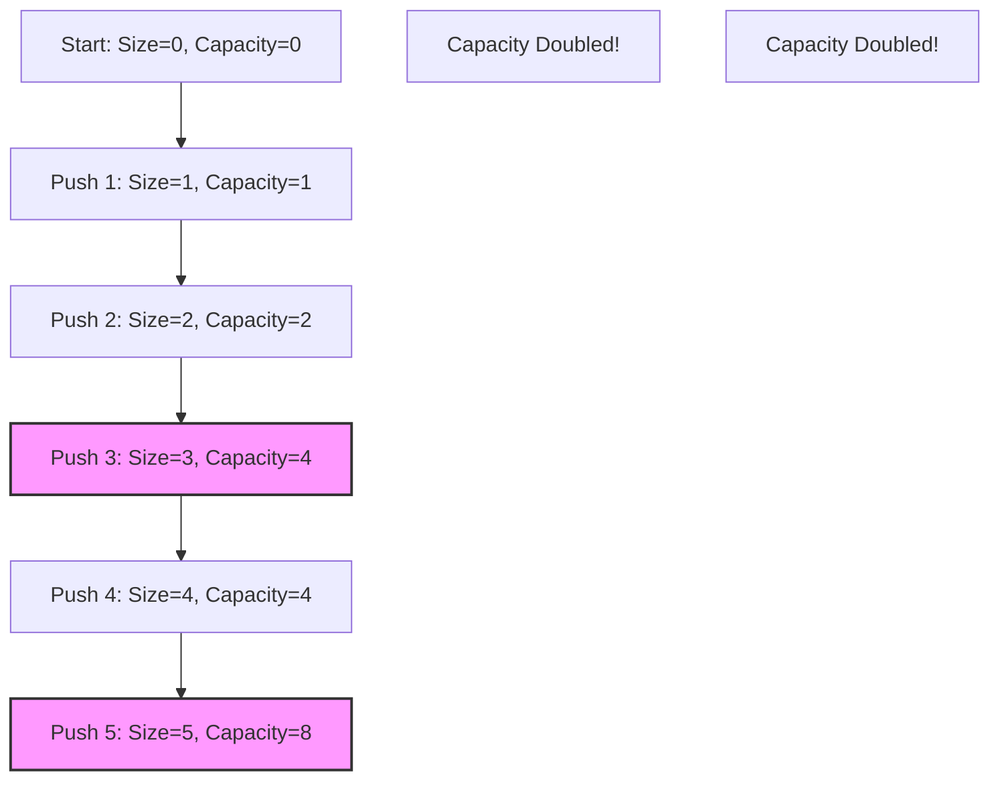

# Data Structures: Arrays and Vectors

Arrays and Vectors are the most fundamental data structures in C++. They allow you to store multiple elements of the same type under a single name.

---

## 1. Static Arrays

A **Static Array** is a collection of elements of the same type stored in **contiguous memory locations**. "Static" means its size must be known at compile time and cannot change during execution.

### **Memory Visualization**
Imagine an array `int arr[5] = {10, 20, 30, 40, 50};`. In memory, these are placed side-by-side:

| Address (approx) | 100 | 104 | 108 | 112 | 116 |
| :--- | :---: | :---: | :---: | :---: | :---: |
| **Value** | **10** | **20** | **30** | **40** | **50** |
| **Index** | 0 | 1 | 2 | 3 | 4 |

> [!NOTE]
> Since an `int` usually takes 4 bytes, the memory addresses jump by 4 (100 -> 104 -> 108...).

### **Pros & Cons**
*   **Pros**: Instant access to any element using an index ($O(1)$ time).
*   **Cons**: Fixed size (cannot shrink or grow). Deleting or inserting elements in the middle is slow ($O(n)$).

---

## 2. Dynamic Vectors (STL)

A **Vector** is a dynamic array provided by the C++ Standard Template Library (STL). It manages its own memory and grows automatically as you add more elements.

### **Why Vectors?**
1.  **Dynamic Sizing**: You don't need to know the size beforehand.
2.  **Safety**: Provides functions like `.at()` which perform bounds checking.
3.  **Ease of Use**: Functions like `push_back()` and `pop_back()` handle memory management for you.

---

## 3. How Vectors Grow (Under the Hood)

When a vector's capacity is full and you add another element, it doesn't just add one space. It **doubles** its capacity to avoid frequent memory reallocations.



---

## 4. Key Vector Operations

| Function | Description | Time Complexity |
| :--- | :--- | :--- |
| `v.push_back(x)` | Adds element `x` to the end. | $O(1)$ (Amortized) |
| `v.pop_back()` | Removes the last element. | $O(1)$ |
| `v.size()` | Returns the number of elements current in vector. | $O(1)$ |
| `v.capacity()` | Returns total space allocated in memory. | $O(1)$ |
| `v.clear()` | Removes all elements. | $O(n)$ |
| `v.at(i)` | Access element at index `i` (with safety). | $O(1)$ |

> [!TIP]
> **Size vs Capacity**: `size` is how many items are *actually* in there. `capacity` is how many items *could* fit before the vector needs to grow.

---

## 5. 2D Arrays and Vectors

A 2D array is essentially an **Array of Arrays**. 

### **2D Vector Syntax**
```cpp
vector<vector<int>> matrix(rows, vector<int>(cols, initial_value));
```

This is very powerful for grid problems (like Sudoku or pathfinding) because each row can technically have a different number of columns (Ragged Array).

---

## 6. Example Program: Arrays vs Vectors

```cpp
#include <iostream>
#include <vector>
using namespace std;

int main() {
    // 1. Static Array
    int staticArr[3] = {1, 2, 3};
    cout << "Static Array Element: " << staticArr[1] << endl;

    // 2. Vector
    vector<int> vec;
    
    vec.push_back(10);
    vec.push_back(20);
    vec.push_back(30);

    cout << "Vector Size: " << vec.size() << endl;          // Output: 3
    cout << "Vector Capacity: " << vec.capacity() << endl; // Output: 4 (on most compilers)

    vec.pop_back();
    cout << "New Size after Pop: " << vec.size() << endl; // Output: 2

    // 3. Iterating through a Vector
    cout << "Vector Elements: ";
    for (int x : vec) {
        cout << x << " ";
    }
    cout << endl;

    return 0;
}
```
