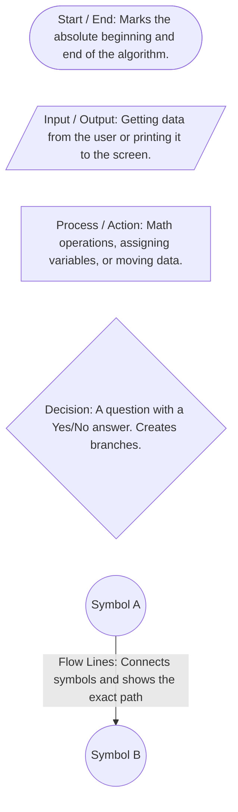
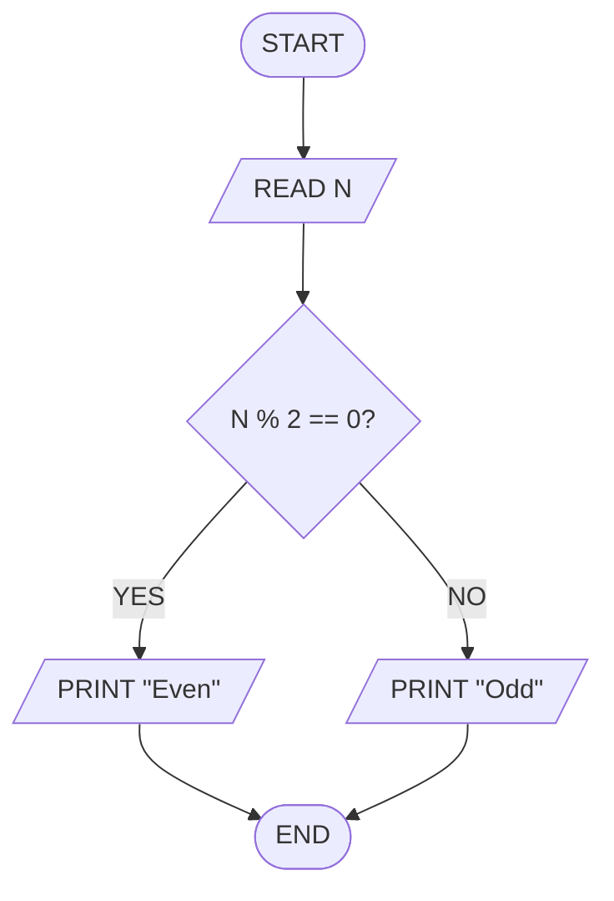

# Day 1: The Blueprint of Logic - Flowcharts & Pseudocode

Before writing a single line of C++, Java, or Python, we have to learn how to **think** like a programmer. 

Jumping straight into code without a plan is like building a house without a blueprint. You *might* get it to stand, but it will probably collapse under edge cases. That is where **Flowcharts** and **Pseudocode** come in.

Pseudocode is a description of an algorithm using everyday wording, but molded to appear similar to a simplified programming language. It bridges the gap between natural language and actual code, allowing programmers to express logic without worrying about specific syntax rules.

---

## 1. Why Do We Need Them?

When solving a DSA problem, your brain is doing two things at once:
1. Figuring out the **logic** (the "how to solve it").
2. Figuring out the **syntax** (the "how to type it in C++").

Trying to do both at the same time leads to bugs and frustration. Flowcharts and pseudocode allow you to isolate the **logic**. Once the logic is perfect, translating it into actual code takes minutes.

---

## 2. Flowcharts: The Visual Blueprint

A flowchart is a step-by-step visual representation of an algorithm. It maps out the flow of data and decisions from the start of your program to the end.

### 📌 Standard Flowchart Symbols



### 🛠️ Example: Is the number Even or Odd?
If we were to draw this out:


---

## 3. Pseudocode: The Universal Language

If flowcharts are the visual diagram, pseudocode is the plain-English script. It looks like code, but it ignores strict syntax rules (like semicolons or curly braces). Anyone, regardless of what programming language they know, should be able to read your pseudocode.

### 📌 Golden Rules of Pseudocode:
* **Keep it simple:** Write it so a 10-year-old could follow the steps.
* **Use keywords:** Capitalize action words like `READ`, `PRINT`, `IF`, `ELSE`, `WHILE`, `COMPUTE`.
* **Indent carefully:** Just like real code, indentation shows which statements belong inside loops or if-statements.

### 🛠️ Example: Find the maximum number in a list

```text
START
  READ list of numbers
  SET max_number TO first number in list
  
  FOR EACH number in list DO
    IF number is greater than max_number THEN
      SET max_number TO number
    END IF
  END FOR
  
  PRINT max_number
END