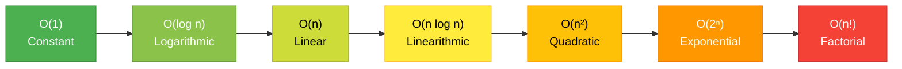

# Time and Space Complexity

When writing algorithms, simply making them work isn't enough. We also need to evaluate **how efficient** they are. This is where Time and Space Complexity come in.

## 1. What is Time Complexity?
Time complexity doesn't measure the *actual time in seconds* an algorithm takes to run. (Because that depends on the processor speed, background tasks, etc.).
Instead, it measures **how the number of operations grows as the input size ($n$) grows**. 

## 2. What is Space Complexity?
Space complexity measures **how much extra memory (RAM) an algorithm uses as the input size ($n$) grows**. 
Like time complexity, we only care about the *extra* or *auxiliary* space, not the memory used to simply hold the input data.

---

## Big O Notation ($O$)
We use **Big O Notation** to describe these complexities. Big O focuses on the **worst-case scenario**—the longest possible time or maximum possible space an algorithm could take.

### The Complexity Hierarchy (Fastest to Slowest)

Here is a visual hierarchy showing how different Big O notations scale. Green is the most efficient, and red is the least efficient.



---

## Detailed Breakdown with Simple Examples

### 1. $O(1)$ - Constant Time/Space (Excellent)
- **Meaning:** The algorithm takes the *same amount of time/space* regardless of how large the input is.
- **Analogy:** Looking at the top item in a box. Whether the box has 10 items or 10,000 items, looking at the top takes the same effort.
- **Example:**
  ```cpp
  int getFirstElement(vector<int>& arr) {
      return arr[0]; // Always takes 1 operation
  }
  ```

### 2. $O(\log n)$ - Logarithmic Time (Very Good)
- **Meaning:** As the input doubles, the number of operations only increases by 1. It cuts the problem size in half with each step.
- **Analogy:** Looking up a word in a dictionary. You open the middle, see if your word is earlier or later, and tear the book in half. You repeat this until you find the word.
- **Example:** Binary Search.

### 3. $O(n)$ - Linear Time (Fair)
- **Meaning:** The number of operations grows directly in proportion to the input size. If the input is 100, it takes 100 operations.
- **Analogy:** Reading every page of a book from start to finish.
- **Example:** 
  ```cpp
  void printAll(vector<int>& arr) {
      for (int i = 0; i < arr.size(); i++) {
          cout << arr[i] << endl;
      }
  }
  ```

### 4. $O(n \log n)$ - Linearithmic Time (Decent)
- **Meaning:** A combination of Linear and Logarithmic. Usually happens when you divide the problem into halves, but also have to look at every element in each level of division.
- **Example:** Efficient sorting algorithms like Merge Sort and Quick Sort.

### 5. $O(n^2)$ - Quadratic Time (Poor)
- **Meaning:** For every element in the input, you have to iterate through the entire input again. If the input is $10$, it takes $100$ operations.
- **Analogy:** Making everyone in a room shake hands with every other person in the room.
- **Example:** Nested loops.
  ```cpp
  void printPairs(vector<int>& arr) {
      for (int i = 0; i < arr.size(); i++) {
          for (int j = 0; j < arr.size(); j++) {
              cout << arr[i] << ", " << arr[j] << endl;
          }
      }
  }
  ```

### 6. $O(2^n)$ - Exponential Time (Terrible)
- **Meaning:** The number of operations doubles with every single new item added to the input.
- **Analogy:** Trying every possible combination to crack a password.
- **Example:** Recursive Fibonacci sequence without memorization.

---

## 3 Rules for Calculating Big O

1. **Drop the Constants:** 
   If your code takes $O(2n)$ operations, we just call it $O(n)$. If it takes $O(n/2)$, it's still $O(n)$. Constants don't matter as $n$ approaches infinity.
2. **Drop the Non-Dominant Terms:** 
   If your code runs in $O(n^2 + n + 10)$, the $n^2$ part is going to be so massive for large inputs that the $+ n + 10$ becomes irrelevant. We simplify it to $O(n^2)$.
3. **Different Inputs get Different Variables:** 
   If you iterate through array $A$ and then array $B$, the complexity is $O(a + b)$, not $O(n)$.

## Quick Summary Table

| Big O Notation | Name | Is it Good? | Example Algorithm |
| :--- | :--- | :--- | :--- |
| **$O(1)$** | Constant | 🟢 Excellent | Array lookup, Hash Map lookup |
| **$O(\log n)$** | Logarithmic | 🟢 Very Good | Binary Search |
| **$O(n)$** | Linear | 🟡 Fair | Simple loop, Linear Search |
| **$O(n \log n)$** | Linearithmic | 🟡 Decent | Merge Sort, Quick Sort |
| **$O(n^2)$** | Quadratic | 🟠 Poor | Bubble Sort, Nested Loops |
| **$O(2^n)$** | Exponential | 🔴 Terrible | Recursive Fibonacci |
